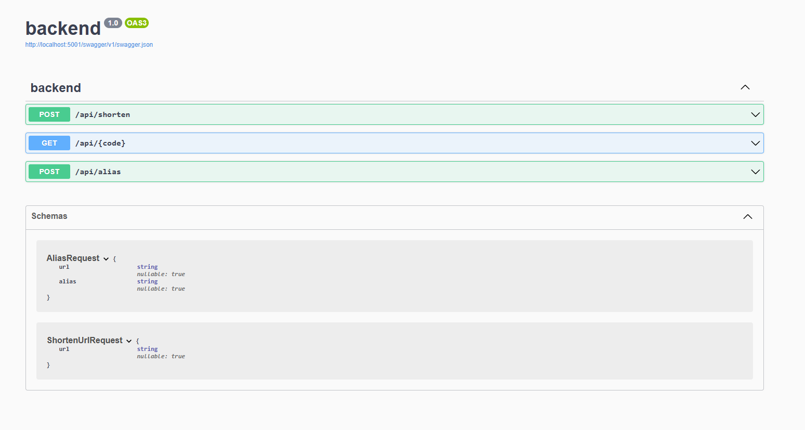

# URL Shortener Application

A simple web application that allows users to shorten URLs and redirect using custom short links. Built with ASP.NET Core Web API (backend) and React with Vite (frontend).

---

## Features

- Generate short links from long URLs
- Redirect to original URLs using the short link
- Stores URL mappings in a database
- Swagger UI for testing API endpoints

---

## Technologies Used

### Backend:
- ASP.NET Core Web API
- Microsoft Entity Framework Core
- SQL Server(Now SQLite for portability)
- Swagger
- xUnit

### Frontend:
- React
- Vite
- SCSS

---

## Installation


### Backend Setup

1. Install [.NET SDK](https://dotnet.microsoft.com/en-us/download)
2. Optional: Install EF Core CLI tools (if not already):
   ```bash
    dotnet tool install --global dotnet-ef
2. In the terminal:
    ```bash
    cd backend
    dotnet ef database update
    dotnet watch run


### Frontend Setup

1. Install [Node.js](https://nodejs.org/en)
2. In the terminal:
   ```bash
    cd frontend
    npm install
    npm run dev

## Running Tests

1. Navigate to the test project folder:
    In the terminal:
    ```bash
    cd UrlServices.Tests
    dotnet test

## Screenshots

- Frontend


- Swagger


---

## Resources & Inspiration

- [FreeFrontend - CSS Forms](https://freefrontend.com/css-forms/)  
  _Used a CSS template to enhance the UI._
  
- [Teddy Smith - ASP.NET Core Web API Playlist + Unit Testing](https://www.youtube.com/@TeddySmithDev)  
  _Helped with backend API structure and setup._

- [System Design: URL Shortener](https://www.youtube.com/watch?v=Cg3XIqs_-4c)  
  _Explains the logic and design behind URL shortening._

- [Short URL Backend Tutorial](https://www.youtube.com/watch?v=2UoA_PoEvuA)  
  _Demonstrates backend creation with Swagger and database integration._

- [Stack Overflow](https://stackoverflow.com/)  
  _Helped troubleshoot coding errors and bugs._

- **ChatGPT (OpenAI)**  
  _Used for general questions, project guidance, and debugging help._

---

