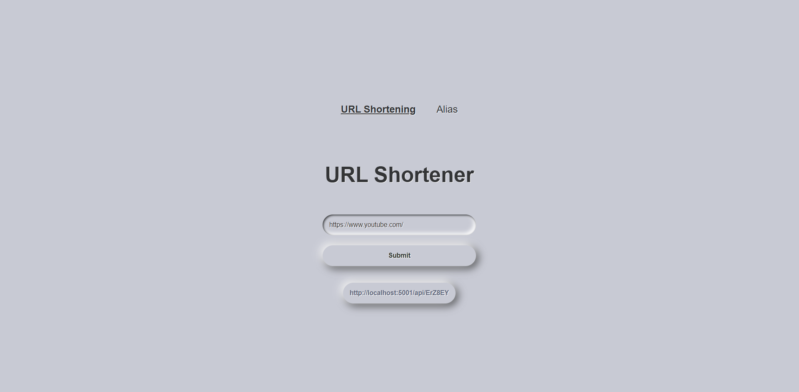

# URL Shortener Application

A simple web application that allows users to shorten URLs and redirect using custom short links. Built with ASP.NET Core Web API (backend) and React with Vite (frontend).

---

## Features

- Generate short links from long URLs
- Redirect to original URLs using the short link
- Stores URL mappings in a database
- Swagger UI for testing API endpoints

---

## Technologies Used

### Backend:
- ASP.NET Core Web API
- Microsoft Entity Framework Core
- SQL Server
- Swagger

### Frontend:
- React
- Vite
- SCSS

---

## 📦 Installation

### Backend Setup

1. Clone the repository and open the backend project in Visual Studio.
2. Configure the connection string to your SQL Server in `appsettings.json`.
3. Run the following commands to create and apply the database:
    - dotnet ef migrations add InitialCreate
    - dotnet ef database update

### Frontend Setup

## 📸 Screenshots

- Frontend

- Swagger

---

## 📚 Resources & Inspiration

- [FreeFrontend - CSS Forms](https://freefrontend.com/css-forms/)  
  _Used a CSS template to enhance the UI._
  
- [Teddy Smith - ASP.NET Core Web API Playlist](https://www.youtube.com/)  
  _Helped with backend API structure and setup._

- [System Design: URL Shortener](https://www.youtube.com/watch?v=Cg3XIqs_-4c)  
  _Explains the logic and design behind URL shortening._

- [Short URL Backend Tutorial](https://www.youtube.com/watch?v=2UoA_PoEvuA)  
  _Demonstrates backend creation with Swagger and database integration._

- [Stack Overflow](https://stackoverflow.com/)  
  _Helped troubleshoot coding errors and bugs._

- **ChatGPT (OpenAI)**  
  _Used for general questions, project guidance, and debugging help._

---

2. Microsoft entity
3. sql server and sql server management studio

FrontEnd:
1. vite + npm install
    * when you install vite and npm, in the CLI you need to type this command *npm install*
    * for the scss you need to write this command *npm install -D sass*
    and to run the frontend you need to type npm run dev

videos and websites that helped me create this application:

https://freefrontend.com/css-forms/ - Used a CSS template to make the website look nice :)

The youtuber Teddy Smith(The ASP.NET Core Web API playlist) - Explained how to use the ASP.NET Web
https://www.youtube.com/watch?v=Cg3XIqs_-4c - Explaied the system design of shoretened url and the logic behind it
https://www.youtube.com/watch?v=2UoA_PoEvuA&t=260s - Shows how to create a shortened url backend with swagger api and database